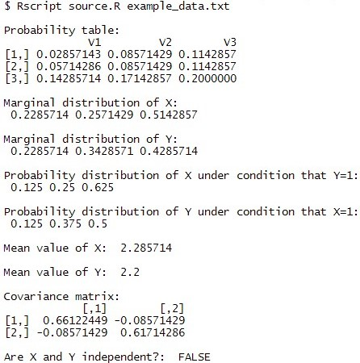

# 2D Random Variable Distribution
Implementation of two dimensional random variable distribution in R made for Probability Theory and Statistics Course at AGH UST 2021/22.

You can find the task description [there](task_description.md).
## User manual
To run the program make sure you have added Rscript.exe to PATH and run the following command
```
Rscript source.R input_file_path
```
where input_file_path is a path to an input file.
## Input file format
In general the files' content has match specification of [read.table](https://www.rdocumentation.org/packages/utils/versions/3.6.2/topics/read.table) function:
- each row of the table appears as one line of the file
- each line contains numbers separated with spaces
- each line constains the same number of numbers
- there has to be a newline at the end of the file

You can find an example input file [there](example_data.txt).
## Example console output

